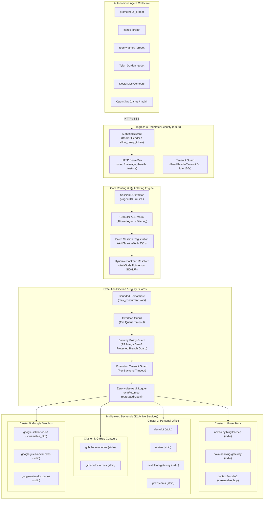

# Architecture & Technical Design

**MCP Router** is a high-throughput, fault-tolerant unified gateway and multiplexer for Model Context Protocol (MCP) servers, engineered specifically for autonomous multi-agent networks.

---

## 🏛️ System Overview

---

## ⚙️ Core Subsystems

### 1. Ingress & Perimeter Security (`auth.go`, `main.go`)
- **Authentication:** Enforces constant-time token comparison (`subtle.ConstantTimeCompare`) on incoming requests.
- **Dual Transport Auth:**
  - Standard: `Authorization: Bearer <token>`
  - Optional Query Token: `?token=<token>` (only accepted when `allow_query_token: true` is configured).
- **HTTP Endpoints:**
  - `GET /sse`: Establishes SSE stream connection for an agent session.
  - `POST /message`: Receives incoming JSON-RPC tool calls and requests.
  - `GET /health`: Returns JSON health status of all 12 multiplexed backends.
  - `GET /metrics`: Exports Prometheus runtime and traffic counters.

### 2. Session Isolation & Batch Registration (`router.go`)
- **Session Identity:** `SessionIDExtractor` extracts the agent identity from:
  1. `X-Agent-ID` HTTP header
  2. `?agent=` URL query parameter
  3. `?agent_id=` URL query parameter
  4. Fallback to `anonymous`
- **UUID Compound Session ID:** Every connection receives a unique session key formatted as `<agentID>:<uuid>`. This ensures total memory and message queue isolation between concurrent sessions from the same agent or different agents.
- **$O(1)$ Batch Tool Registration:** Tools matching the agent's ACL permissions are registered in bulk using `server.AddSessionTools()`, eliminating $O(N^2)$ map re-allocations during session setup.

### 3. Dynamic Backend Resolution & SIGHUP Zero-Downtime Reload (`multiplexer.go`)
- **Anti-Stale Pointer Pattern:** Tool execution closures do not bind directly to backend pointer instances. Instead, they invoke `mux.GetBackend(backendName)` dynamically on each invocation.
- **Shadow-Init Atomic Swap:** When `SIGHUP` is received:
  1. The new configuration is validated in memory.
  2. Existing unchanged backends remain active and continue processing calls under read-lock.
  3. Modified or new backends are initialized asynchronously.
  4. The internal pointer map is swapped atomically.
  5. Retired backends are closed gracefully. Active sessions experience **zero dropped calls and zero downtime**.

### 4. Concurrency Limiting & Overload Protection (`router.go`)
- **Per-Backend Worker Semaphore:** Each backend allocates a bounded buffered channel (`chan struct{}`) sized to `max_concurrent` (default: 50).
- **15-Second Overload Timeout:** If all worker slots are saturated, calls queue for at most 15 seconds. If a slot does not become available, the call fails fast with an overload error, protecting downstream subprocesses from death spirals.

### 5. Multi-Transport Client Support (`multiplexer.go`)
- **`stdio`:** Launches subprocesses with sanitized environment (`ExpandedEnv`) and communicates over JSON-RPC stdin/stdout pipes.
- **`streamable_http`:** Connects to modern POST-based HTTP MCP endpoints (used by Context7 and Google Stitch) with custom headers.
- **`sse` / `http`:** Connects to legacy SSE event streams.

### 6. Zero-Noise Structured Audit Logging (`logger.go`)
- Filters routine read operations (`200 OK`) to avoid logging terabytes of routine queries.
- Records structured events for:
  - `SECURITY_BLOCK`: PR merge attempts, protected branch direct pushes, unauthorized auth attempts.
  - `STATE_CHANGE`: Mutating operations (`push_files`, `send_email`, `write_file`, `create_issue`, etc.).
  - `TOOL_ERROR`: Subprocess crashes, execution timeouts, backend deadlocks.
- Sensitive credentials (PATs, JWTs, AWS keys, passwords) are automatically redacted.
- Seamlessly reopens the log file on `SIGHUP` for compatibility with system log rotation (`logrotate`).
