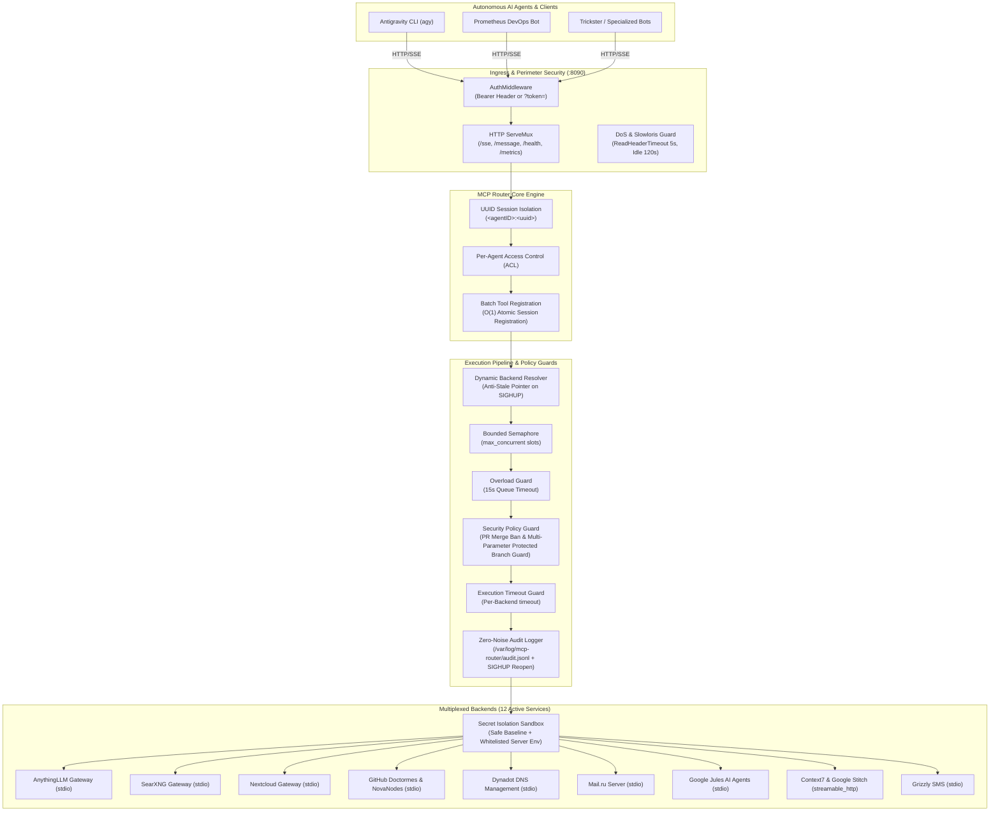

# 🛸 MCP Router (Unified Gateway)

[](https://golang.org/)
[](LICENSE)
[](https://modelcontextprotocol.io/)
[](https://github.com/TheNovaNodes/mcp-router/actions)
[](https://github.com/TheNovaNodes/mcp-router)

📚 **Documentation Suite:** [Architecture](ARCHITECTURE.md) • [Contributing](CONTRIBUTING.md) • [Security Policy](SECURITY.md) • [Changelog](CHANGELOG.md) • [License](LICENSE)

A high-performance, production-hardened **Unified Model Context Protocol (MCP) Router and Multiplexer** written in Go for autonomous AI agent networks.

Instead of spawning dozens of redundant MCP server processes for every agent, the **MCP Router** acts as a centralized proxy gateway. Autonomous agents connect to a single endpoint via Server-Sent Events (SSE), while the router dynamically multiplexes and proxies requests to underlying local (`stdio`) subprocesses and remote (`http`/`sse`/`streamable_http`) MCP backends based on granular Access Control Lists (ACL), strict security policies, and bounded worker pools.

---

## 🏛️ System Architecture



---

## 🚀 Quick Start (60 Seconds)

### Option A: Run with Docker Compose (Recommended)
```bash
# 1. Clone repository
git clone https://github.com/TheNovaNodes/mcp-router.git
cd mcp-router

# 2. Prepare configuration
cp config.example.yaml config.yaml

# 3. Start gateway container
docker compose up -d

# 4. Check health probe
curl -i http://localhost:8090/health
```

### Option B: Build and Run from Source
```bash
# Prerequisites: Go 1.25+
go build -v -o mcp-router .

# Launch gateway daemon
./mcp-router -config config.example.yaml -port :8090
```

### 🔌 Client Connection Quick-Reference

#### 1. Claude Desktop (`claude_desktop_config.json`)
```json
{
  "mcpServers": {
    "mcp-router": {
      "command": "npx",
      "args": [
        "-y",
        "mcp-proxy",
        "http://localhost:8090/sse",
        "--header",
        "Authorization: Bearer YOUR_TOKEN_HERE"
      ]
    }
  }
}
```

#### 2. Cursor IDE / Windsurf
In Settings -> Features -> MCP Servers:
- **Transport:** `SSE`
- **URL:** `http://localhost:8090/sse`
- **Headers:** `Authorization: Bearer YOUR_TOKEN_HERE`

#### 3. Antigravity CLI (`agy`) & Autonomous Agents
Connect via single aggregated Server-Sent Events (SSE) socket with composite agent session routing:
```bash
# Agent connects passing its identifier in X-Agent-ID header
curl -N -H "Authorization: Bearer YOUR_TOKEN_HERE" \
     -H "X-Agent-ID: kairos_brobot" \
     http://localhost:8090/sse
```

---

## ⚡ Key Features & Engineering Highlights

1. **Non-Blocking Concurrent Startup**:
   - Asynchronous backend initialization using `sync.WaitGroup`, reducing router boot time from $O(N)$ sequential delays to $O(1)$ concurrent startup.
2. **Concurrency Throttling & Worker Pools**:
   - Bounded per-backend semaphore channels (`max_concurrent`, default 50) preventing process and socket starvation during parallel agent request bursts.
   - **Overload Guard**: 15-second queue acquisition timeout preventing agent requests from blocking indefinitely when worker pools are saturated.
3. **Execution Timeout Guard**:
   - Configurable per-backend execution timeout (`timeout`, in seconds, default 60s) on `CallTool` operations to isolate and fail-fast on hung subprocesses.
4. **Active Backend Health Verification (`/health`)**:
   - Active health check inspecting transport connection and cached tools. Reports `READY` when connected with tools, `UP` when alive with 0 tools, and `DEGRADED` if disconnected.
   - Returns **HTTP 200 OK** (`healthy`) when all backends are up, or **HTTP 207 Multi-Status** (`degraded`) if any backend fails.
5. **Dynamic Session Isolation (UUID) & Batch Registration ($O(1)$)**:
   - Generates unique composite session identifiers `<agentID>:<uuid>` per connection via `uuid.New()`.
   - Batch tool registration via `s.AddSessionTools` avoids repeated $O(N^2)$ map copies during session connection, cutting session setup latency by >99%.
6. **Host Secret Isolation & Environment Sanitization**:
   - `ExpandedEnv()` explicitly inherits only a safe minimal system baseline (`PATH`, `TMPDIR`, `TEMP`, `TMP`, `LANG`, `LC_ALL`, `TZ`) merged with declared `s.Env`.
   - `HOME` and `USER` are **deliberately excluded** from default subprocess environments to prevent child processes from inspecting sensitive credentials (`~/.ssh`, `~/.netrc`, `~/.aws`). Host variables can be explicitly allowed via `env_inherit:`.
7. **Perimeter Security & Dual Authentication**:
   - Constant-time Bearer Token authentication resisting timing attacks (`crypto/subtle.ConstantTimeCompare`).
   - Supports `Authorization: Bearer <token>` HTTP headers as primary auth, and optional `?token=<token>` query strings for header-constrained SSE clients (when `allow_query_token: true` is explicitly enabled).
8. **Strict Security Policy Enforcement & Hardened Branch Guard**:
   - **PR Merge Ban**: AI agents are strictly blocked from invoking `merge_pull_request`.
   - **Multi-Parameter Protected Branch Guard**: Direct mutations (`push_files`, `create_or_update_file`, `delete_file`, `create_branch`, `update_pull_request_branch`) targeting `main` or `master` branches (across all git ref formats `refs/heads/*`, `origin/*`, `refs/remotes/*` and argument parameter names `branch`, `ref`, `target_branch`, `base`, `head`, `dest`, `branch_name`, `target`, `base_branch`, `target_ref`) are intercepted and rejected. Agents are required to work through dedicated feature branches and PRs.
   - Intelligent key matching prevents false positives on file paths (e.g. `src/main/App.java`) or commit messages.
9. **Dynamic Backend Resolution (Anti-Stale Pointer on SIGHUP)**:
   - Tool execution closures dynamically query `mux.GetBackend(backendName)` on each invocation instead of holding a stale pointer to the initial backend instance. When a backend is reconnected or reloaded on `SIGHUP`, active agent sessions immediately use the fresh client without broken pipes or connection resets.
10. **Zero-Noise Structured Audit Logging with Logrotate Support (`/var/log/mcp-router/audit.jsonl`)**:
    - Routine read operations (`200 OK`) are silently filtered to avoid disk flooding. Emits structured JSON-lines for `SECURITY_BLOCK`, `STATE_CHANGE`, and `TOOL_ERROR`.
    - Automatically sanitizes and redacts sensitive argument values (passwords, tokens, API keys, private keys).
    - `globalAuditLogger.Reopen()` closes and re-opens the log descriptor on `SIGHUP`, integrating seamlessly with system `logrotate`.
11. **Graceful Teardown (`SIGINT`, `SIGTERM`)**:
    - 10-second HTTP connection drain timeout followed by clean subprocess termination (`mux.Stop()`) to guarantee zero zombie processes.
12. **Native Streamable HTTP Transport Support (`streamable_http`)**:
    - Supports modern POST-based MCP streamable HTTP servers (with `Accept: application/json, text/event-stream`) alongside legacy SSE and stdio transports. Enables full compatibility with Context7 documentation gateways and next-generation MCP backends.

---

## 📦 Active Ecosystem Backends

The production router currently multiplexes **12 canonical ecosystem services** partitioned across 4 active security clusters (Cluster 3 decommissioned):

| Backend Name | Prefix | Transport | Security Cluster & Allowed Agents | Key Environment Variables |
| :--- | :--- | :--- | :--- | :--- |
| **`nova-anythingllm-mcp`** | `nova-anythingllm-mcp__` | `stdio` | Cluster 1: Base Stack (All Agents) | `MG_API_KEY`, `MG_ALM_BASE` |
| **`nova-searxng-gateway`** | `nova-searxng-gateway__` | `stdio` | Cluster 1: Base Stack (All Agents) | `SEARXNG_URL` |
| **`nextcloud-gateway`** | `nextcloud-gateway__` | `stdio` | Cluster 2: Personal Office (`kairos_brobot`) | `NC_URL`, `NC_USER`, `NC_APP_PASSWORD` |
| **`github-novanodes`** | `gh-novanodes__` | `stdio` | Cluster 4: TheNovaNodes Contour (Core Agents + OpenClaw) | `GITHUB_PERSONAL_ACCESS_TOKEN` |
| **`github-doctormes`** | `gh-doctormes__` | `stdio` | Cluster 4: DoctorMes Contour (3 Agents) | `GITHUB_PERSONAL_ACCESS_TOKEN` |
| **`dynadot`** | `dynadot__` | `stdio` | Cluster 2: Personal Office (`kairos_brobot`) | `DYNADOT_API_KEY` |
| **`mailru`** | `mailru__` | `stdio` | Cluster 2: Personal Office (`kairos_brobot`) | `MAILRU_USERNAME`, `MAILRU_APP_PASS` |
| **`grizzly-sms`** | `grizzly__` | `stdio` | Cluster 2: Personal Office (`kairos_brobot`) | `GRIZZLY_SMS_API_KEY`, `GRIZZLY_SMS_BASE_URL` |
| **`google-jules-novanodes`** | `google-jules-novanodes__` | `stdio` | Cluster 5: Google Sandbox (`Tyler_Durden_gobot`) | `JULES_API_KEY_NOVANODES`, `PYTHONPATH` |
| **`google-jules-doctormes`** | `google-jules-doctormes__` | `stdio` | Cluster 5: Google Sandbox (`Tyler_Durden_gobot`) | `JULES_API_KEY_DOCTORMES`, `PYTHONPATH` |
| **`context7-node-1`** | `ctx7-node-1__` | `streamable_http` | Cluster 1: Base Stack (All Agents) | `CONTEXT7_TOKEN_1` |
| **`google-stitch-node-1`** | `stitch-node-1__` | `streamable_http` | Cluster 5: Google Sandbox (`Tyler_Durden_gobot`) | `GOOGLE_STITCH_TOKEN_1` |


---

## ⚙️ Configuration Reference (`config.yaml`)

All string fields support dynamic environment variable interpolation via `${ENV_VAR}` syntax. Sensitive secrets should be stored in a protected `.env` file (`chmod 0600`) rather than committed to source control.

```yaml
audit:
  path: "/var/log/mcp-router/audit.jsonl"
  fallback_path: "audit.jsonl"
  required: false

auth:
  enabled: true
  bearer_token: "${MCP_ROUTER_BEARER_TOKEN}"
  allow_query_token: false # Set true ONLY if SSE clients cannot send HTTP headers

# Optional TLS transport encryption
tls:
  enabled: false
  cert_file: "/etc/mcp-router/certs/server.crt"
  key_file: "/etc/mcp-router/certs/server.key"

servers:
  # Cluster 1: Base Stack (Open to all 9 agents, no allowed_agents restriction)
  nova-anythingllm-mcp:
    max_concurrent: 50
    timeout: 60
    transport: stdio
    command: /usr/local/bin/anythingllm-gateway
    args: []
    env:
      MG_ALM_BASE: http://127.0.0.1:3002/api/v1
      MG_API_KEY: ${MG_API_KEY}
      MG_WORKSPACE: default
    prefix: nova-anythingllm-mcp__

  # Cluster 4: GitHub Organization
  github-novanodes:
    type: github
    max_concurrent: 50
    timeout: 60
    transport: stdio
    command: npx
    args:
      - -y
      - "@modelcontextprotocol/server-github"
    env:
      GITHUB_PERSONAL_ACCESS_TOKEN: ${GITHUB_PAT_NOVANODES}
    prefix: gh-novanodes__

  # Cluster 2: Personal Office (Strictly restricted to kairos_brobot)
  dynadot:
    type: dynadot
    max_concurrent: 20
    transport: stdio
    command: /usr/bin/dynadot-mcp
    args: []
    env:
      DYNADOT_API_KEY: ${DYNADOT_API_KEY}
    prefix: "dynadot__"
    allowed_agents:
      - "kairos_brobot"
```

A complete configuration template is available in [`config.example.yaml`](config.example.yaml).

---

## 🔒 Client Authentication & Connection

### 1. HTTP Header Authentication
For standard clients that support custom headers:
```bash
curl -i -N \
  -H "Authorization: Bearer ${MCP_ROUTER_BEARER_TOKEN}" \
  -H "X-Agent-ID: prometheus_brobot" \
  http://127.0.0.1:8090/sse
```

### 2. Query Parameter Authentication & Agent ID (Headerless Clients)
For SSE clients that only take a URL (such as Antigravity CLI's `mcp_config.json`), pass the bearer token and the agent identifier via query parameters (`?agent=` or `?agent_id=`):

> [!IMPORTANT]
> To authenticate via `?token=`, you **MUST** configure `allow_query_token: true` in the `auth:` section of `config.yaml`. By default, query token authentication is rejected with `401 Unauthorized` to prevent token leakage in proxy logs and browser history.

```json
{
  "mcpServers": {
    "mcp-router": {
      "serverUrl": "http://localhost:8090/sse?token=YOUR_BEARER_TOKEN&agent=prometheus_brobot"
    }
  }
}
```

---

## 📊 Telemetry & Observability

### Health Monitoring (`/health`)
Query the real-time status of all multiplexed backends:
```bash
curl -s http://127.0.0.1:8090/health | jq .
```

Example response:
```json
{
  "status": "healthy",
  "timestamp": "2026-09-05T11:20:34Z",
  "audit_logger": "UP",
  "backends": {
    "context7-node-1": "READY",
    "dynadot": "READY",
    "github-doctormes": "READY",
    "github-novanodes": "READY",
    "google-jules-doctormes": "READY",
    "google-jules-novanodes": "READY",
    "google-stitch-node-1": "READY",
    "mailru": "READY",
    "nextcloud-gateway": "READY",
    "nova-anythingllm-mcp": "READY",
    "nova-searxng-control": "READY",
    "nova-searxng-gateway": "READY"
  }
}
```

### Prometheus Metrics (`/metrics`)
Prometheus scrapes operational metrics including Go runtime statistics and HTTP performance counters:
```bash
curl -s http://127.0.0.1:8090/metrics | head -n 25
```

---

## 🛠️ Operations & Administration

### 1. Compilation
```bash
go build -v -o mcp-router .
```

### 2. Running the Daemon
```bash
# Run with default config (config.yaml) on port :8090
./mcp-router

# Run with custom config and port
./mcp-router -config /etc/mcp-router/config.yaml -port :8095
```

### 3. Systemd Service Management
The daemon is managed as a `systemd` service:
```bash
# Check service status
systemctl status mcp-router

# Hot-reload configuration without downtime
systemctl reload mcp-router

# Restart service
systemctl restart mcp-router

# View live audit and server logs
journalctl -u mcp-router -f --no-pager
```

### 4. Unit Testing & Race Detection
```bash
# Run all unit tests with race detection and coverage profiling
go test -v -race -coverprofile=coverage.out ./...

# View coverage summary per function
go tool cover -func=coverage.out
```

---

## 🔄 Ecosystem Backends Operational Status

All **14 canonical ecosystem services** are fully restored, production-hardened, and operating with active healthy status:

- ✅ **Google Stitch Nodes (`google-stitch-*`)**: **RESTORED & ACTIVE**. Operates via native `streamable_http` POST transport (`https://stitch.googleapis.com/mcp`) providing Google ecosystem tools for `Tyler_Durden_gobot`.
- ✅ **Google Jules AI Agents (`google-jules-*`)**: **RESTORED & ACTIVE**. Operates via Python virtual environment with explicit `PYTHONPATH` isolation, providing asynchronous repository task delegation tools (`list_jules_sources`, `delegate_task_to_jules`, `check_jules_status`).
- ✅ **Context7 Documentation Gateways (`context7-*`)**: **RESTORED & ACTIVE**. Operates via native `streamable_http` POST transport with `Accept: application/json, text/event-stream`, providing live documentation queries (`resolve-library-id`, `query-docs`).
- ✅ **Mail.ru Server (`mailru`)**: **RESTORED & ACTIVE**. High-performance Go implementation providing IMAP/SMTP/WebDAV MCP endpoints.
- ✅ **10 Other Backends**: Fully operational across Base Stack, Personal Office, R&D Control, and GitHub Contours. All 14 backends report `READY` in `/health`.

---

## 🛡️ License

Built with precision by [The NovaNodes Collective](https://github.com/TheNovaNodes).  
Licensed under the MIT License.
